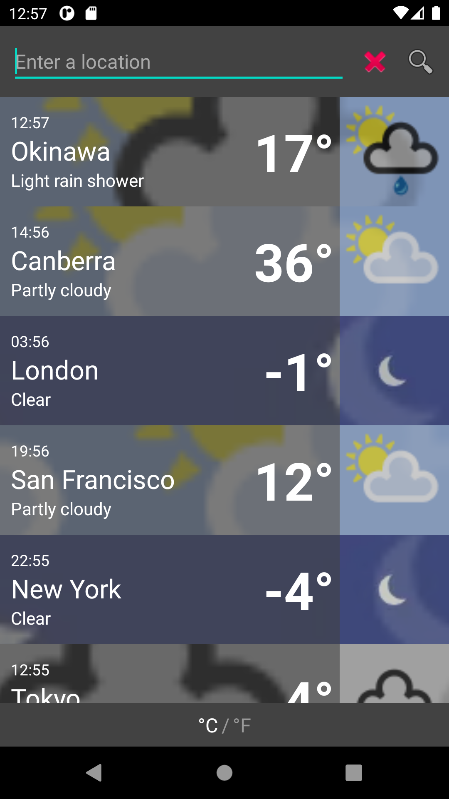
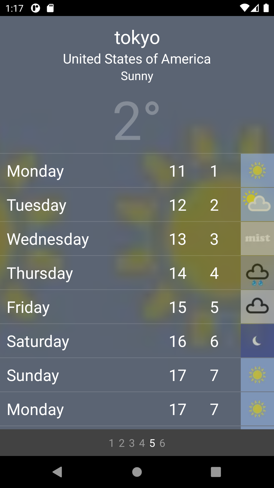

# WeatherApp

### TODO List

#### Features
 - API implementation, done
 - API AccessKey encryption, simple
 - API AccessKey remote retrieving, to do
 - Weather bean, done
 - Current/Daily, done
 - Forecast/Hourly, need to upgrade subscription plan
 - Sunrise/Sunset, other data, to do
 - Hourly horizontal scrollview, to do
 - City search auto prompt, to do
 - Json serialization, done
 - Local storage persistence, done
 - Mock data request, done
 - Search screen, done
 - Detail screen, done
 - Flowing image background, done, need nice video format
 - Unit switch widget, done
 - nice icons/ic_launcher, to do
 - RecyclerView, done
 - SwipeToDelete, to do
 - ViewPager swipe, done
 - ViewPager Indicators, done, to improve
 - ParallaxListView, done, to improve
 - ConstrainedLayout, done
 - ProgressBar, done, to improve
 - Activity animation, done
 - Color selector, done
 - Fragment, to do
 - Pad compatible, to do
 - Orientation compatible, to do
 - Language change, to do
 - Kotlin, to do
 - RxJava, not used
 - Proguard, to do
 - apk sign, done
 - Github upload, done
 
 
 #### Coding check
 - xml strings, done
 - xml colors, done
 - hard-coded strings, several remaining
 - comments, simple notes
 - private class, checked
 - imports, checked
 
 ### Demo
 
 
 
 